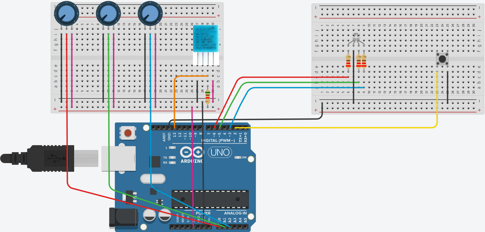

# Project-work ITS Imola 2021-23 - IoT - Arduino

## Description

Arudino Code for LED RGB, Potentiometer and Temperature Sensor DHT11 with communication via serial port.

This Arduino sketch performs the following tasks:

- Reads the temperature from the DHT11 sensor.
- Receives commands from the serial port to read the temperature and replies with the temperature, humidity, and heat index.
- Receives commands from the serial port to turn on/off the RGB LED and replies with the status of the LED.
- Uses a button to step the RGB LED through 3 different modes/statuses or turn it off in between modes:
    1. RGB LED passes through the colors of the rainbow.
    2. RGB LED changes color depending on the temperature.
    3. RGB LED changes color depending on the potentiometer values.

This is the schematic of the circuit:

## Table of Contents

- [Requirements](#requirements)
- [Installation](#installation)
- [Code Explanation](#code-explanation)
- [Credits](#credits)
- [License](#license)

## Requirements

To use this Arduino sketch, you will need the following components:

- An Arduino board (e.g., Arduino Uno)
- An RGB LED
- Three potentiometers
- A DHT11 temperature sensor
- A push-button
- 3 220 ohm resistors
- 1 5.1k ohm resistor
- Jumper wires and a breadboard

## Installation

1. Download and install the Arduino IDE on your computer.
2. Clone this repository or download the sketch file.
3. Open the sketch file in the Arduino IDE.
4. Install the library for the DHT11 sensor by following the instructions [here](https://www.arduino.cc/reference/en/libraries/dht-sensor-library/).
5. Connect the components as shown in the schematic above.
6. Upload the sketch to your Arduino board.

## Code Explanation

1. Defines pins for the RGB LED, potentiometers, button, and DHT11 sensor.

2. Declares variables for storing color values, potentiometer values, temperature-based color values, and other necessary information.

3. In the `setup()` function:
    - Initializes the Serial communication.
    - Sets up the pins for the RGB LED, potentiometers, and button.
    - Attaches an interrupt to the button for detecting a press event.
    - Initializes the DHT11 sensor.

4. In the `loop()` function:
    - Checks if the `toggle` variable (controlled by the button press) is set to 1.
    - If the `toggle` variable is set to 1, the program goes through different sequences:
        - Sequence 1: Calls the `RGB()` function, which controls the LED to cycle through the colors of the rainbow.
        - Sequence 2: Calls the `tempRGB()` function, which controls the LED to change color based on the temperature readings from the DHT11 sensor.
        - Sequence 3: Calls the `potRGB()` function, which controls the LED to change color based on the potentiometer values.

    The program cycles through these sequences each time the button is pressed.

5. In the receive_serial() function:
    - If the incoming byte is equal to `turnOn` and the `toggle` variable is 0, the function sets `toggle` to 1, resets the `sequence` to 0, and sends the `turnedOn` response via the Serial connection.
    - If the incoming byte is equal to `turnOn` and the `toggle` variable is 1, the function sends the `alreadyOn` response via the Serial connection.
    - If the incoming byte is equal to `turnOff` and the `toggle` variable is 1, the function sets `toggle` to 0 and sends the `turnedOff` response via the Serial connection.
    - If the incoming byte is equal to `turnOff` and the `toggle` variable is 0, the function sends the `alreadyOff` response via the Serial connection.
    - If the incoming byte is equal to `readTemp`, the function reads the temperature, humidity, and heat index from the DHT11 sensor and sends the float values via the Serial connection using the `sendFloat()` function.

6. The `sendFloat()` function takes a float value and sends it as a sequence of four bytes via the Serial connection.

7. The `RGB()` function cycles the RGB LED through the colors of the rainbow using a while loop for each color transition. The function checks the `toggle` and `sequence` variables to determine whether to continue or exit the loop. The function also checks for incoming serial data by calling the `receive_serial()` function. If the incoming byte matches any of the expected commands, the `receive_serial()` function will update the `toggle` and `sequence` variables accordingly, which will affect the behavior of the `RGB()` function.

8. The `tempRGB()` function is responsible for changing the RGB LED color based on the temperature readings from the DHT11 sensor. It executes in a while loop when `toggle` is equal to 1 and `sequence` is equal to 2. The function checks for incoming serial data by calling the `receive_serial()` function. It updates the LED color every 60 seconds (60000 milliseconds) based on the heat index value calculated from the temperature and humidity readings. The LED color is set as follows:
    - If the heat index is less than 0, the LED color is set to blue.
    - If the heat index is greater than 30, the LED color is set to red.
    - If the heat index is between 0 and 15, the LED color transitions from blue to green.
    - If the heat index is between 15 and 30, the LED color transitions from green to red.

9. The `potRGB()` function is responsible for changing the RGB LED color based on the potentiometer values. It executes in a while loop when `toggle` is equal to 1 and `sequence` is equal to 0. The function checks for incoming serial data by calling the `receive_serial()` function. It reads the potentiometer values, maps them to the range of 0 to 255, and updates the LED color accordingly.

10. The `press()` function is an interrupt service routine (ISR) that is triggered when the button is pressed. The ISR should update the `sequence` variable to cycle through the different modes (rainbow, temperature-based, and potentiometer-based) and toggle the RGB LED on and off.

## Credits

- [Matteo Kevin Gardi](https://github.com/MaKeG0)
- [Alessandro Boschetti](https://github.com/alessandroboschetti)

## License

MIT License

Copyright (c) 2023 Matteo Kevin Gardi, Alessandro Boschetti

Permission is hereby granted, free of charge, to any person obtaining a copy
of this software and associated documentation files (the "Software"), to deal
in the Software without restriction, including without limitation the rights
to use, copy, modify, merge, publish, distribute, sublicense, and/or sell
copies of the Software, and to permit persons to whom the Software is
furnished to do so, subject to the following conditions:

The above copyright notice and this permission notice shall be included in all
copies or substantial portions of the Software.

THE SOFTWARE IS PROVIDED "AS IS", WITHOUT WARRANTY OF ANY KIND, EXPRESS OR
IMPLIED, INCLUDING BUT NOT LIMITED TO THE WARRANTIES OF MERCHANTABILITY,
FITNESS FOR A PARTICULAR PURPOSE AND NONINFRINGEMENT. IN NO EVENT SHALL THE
AUTHORS OR COPYRIGHT HOLDERS BE LIABLE FOR ANY CLAIM, DAMAGES OR OTHER
LIABILITY, WHETHER IN AN ACTION OF CONTRACT, TORT OR OTHERWISE, ARISING FROM,
OUT OF OR IN CONNECTION WITH THE SOFTWARE OR THE USE OR OTHER DEALINGS IN THE
SOFTWARE.