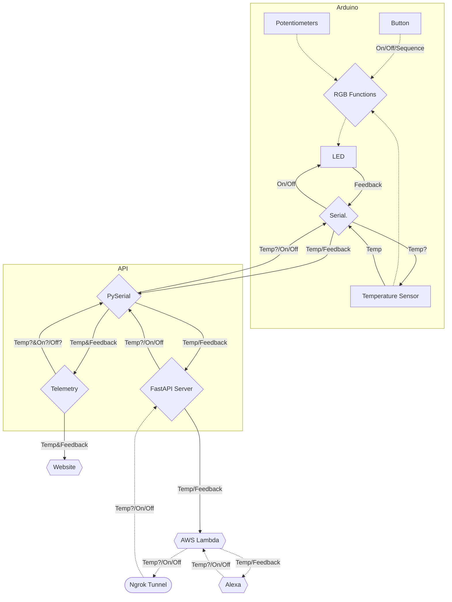
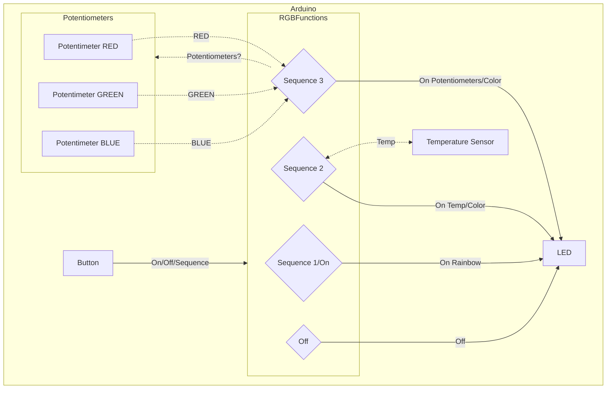
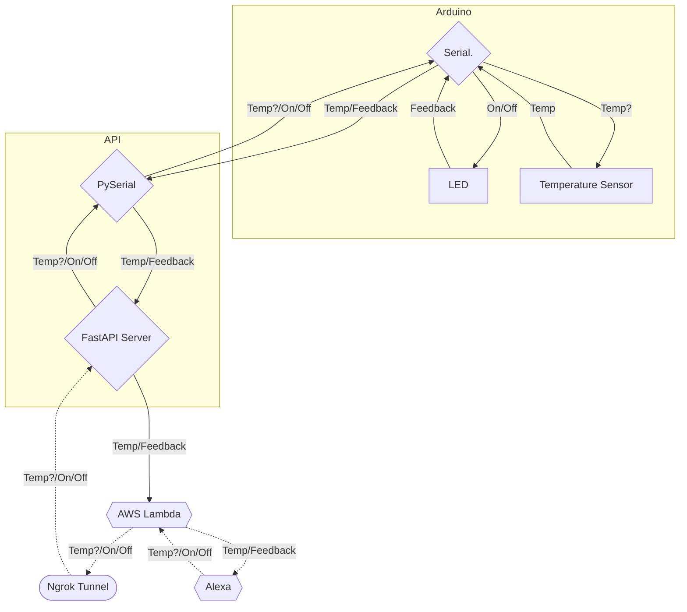
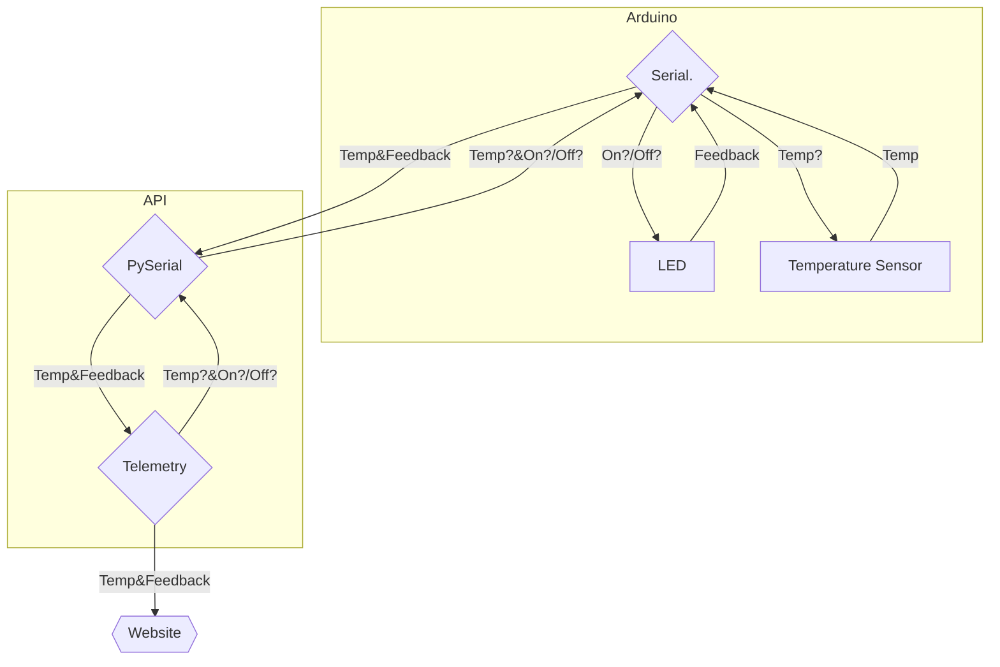

# Project-work ITS Imola 2021-23 - IoT - Overview

## Description

This the introduction to the IoT project which is divided into two main parts:

- [Arduino](Arduino/)
- [API](API/)

The [Arduino part](Arduino/README.md) has it's own documentation in it's directory, as well the [API part](API/README.md), this is just an introduction.

To help you understand it better, here are some flowcharts that provide additional context to the rest of the documentation and code.

## Table of Contents

- [Complete flowchart of the IoT project](#complete-flowchart-of-the-iot-project)
- [Arduino](#arduino)
- [Alexa-Arduino](#alexa-arduino)
- [Telemetry](#telemetry)
- [Credits](#credits)
- [License](#license)

## Complete flowchart of the IoT project

This comprehensive flowchart depicts the primary steps directly involved in the IoT section of the project.

Due to its complexity, it has been divided into three parts.

## Arduino

The Arduino code has some inherent functionalities. The flowchart below displays them.
You can find more dettails in the [Arduino part](Arduino/README.md).

## Alexa-Arduino

This flowchart primarily shows the functionality of the Alexa-Arduino, which is the main part of the whole project.
You can find more dettails in the [API part](API/README.md).

## Telemetry

Here is a flowchart of the Telemetry part of the IoT part of the project.
You can find more dettails in the [API part](API/README.md).

## Credits

- [Matteo Kevin Gardi](https://github.com/MaKeG0)
- [Alessandro Boschetti](https://github.com/alessandroboschetti)

## License

MIT License

Copyright (c) 2023 Matteo Kevin Gardi, Alessandro Boschetti

Permission is hereby granted, free of charge, to any person obtaining a copy
of this software and associated documentation files (the "Software"), to deal
in the Software without restriction, including without limitation the rights
to use, copy, modify, merge, publish, distribute, sublicense, and/or sell
copies of the Software, and to permit persons to whom the Software is
furnished to do so, subject to the following conditions:

The above copyright notice and this permission notice shall be included in all
copies or substantial portions of the Software.

THE SOFTWARE IS PROVIDED "AS IS", WITHOUT WARRANTY OF ANY KIND, EXPRESS OR
IMPLIED, INCLUDING BUT NOT LIMITED TO THE WARRANTIES OF MERCHANTABILITY,
FITNESS FOR A PARTICULAR PURPOSE AND NONINFRINGEMENT. IN NO EVENT SHALL THE
AUTHORS OR COPYRIGHT HOLDERS BE LIABLE FOR ANY CLAIM, DAMAGES OR OTHER
LIABILITY, WHETHER IN AN ACTION OF CONTRACT, TORT OR OTHERWISE, ARISING FROM,
OUT OF OR IN CONNECTION WITH THE SOFTWARE OR THE USE OR OTHER DEALINGS IN THE
SOFTWARE.